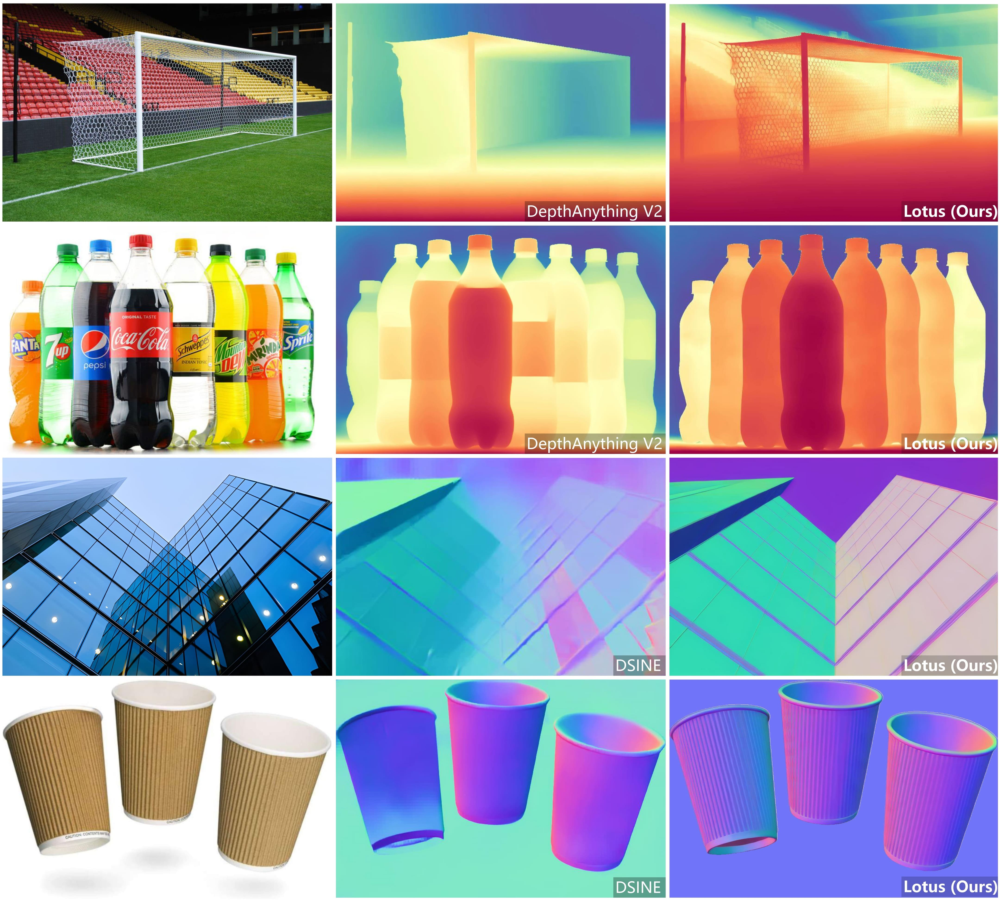
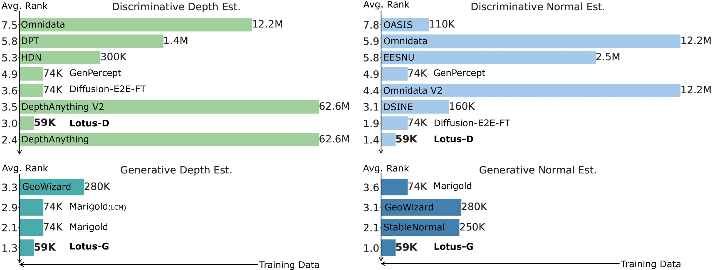

#  Lotus: Diffusion-based Visual Foundation Model for High-quality Dense Prediction

[](https://lotus3d.github.io/)
[](https://arxiv.org/abs/2409.18124)
[-yellow)](https://huggingface.co/spaces/haodongli/Lotus_Depth)
[-yellow)](https://huggingface.co/spaces/haodongli/Lotus_Normal)
[![ComfyUI](https://img.shields.io/badge/%20ComfyUI-Demo%20&%20Cloud%20API-%23C18CC1?logo=data:image/svg+xml;base64,PD94bWwgdmVyc2lvbj0iMS4wIiBlbmNvZGluZz0iVVRGLTgiPz48c3ZnIGlkPSJhIiB4bWxucz0iaHR0cDovL3d3dy53My5vcmcvMjAwMC9zdmciIHhtbG5zOnhsaW5rPSJodHRwOi8vd3d3LnczLm9yZy8xOTk5L3hsaW5rIiB2aWV3Qm94PSIwIDAgNzk5Ljk5OTk5OTMgNzk5Ljk5OTk5OTciPjxkZWZzPjxzdHlsZT4uZHtmaWxsOnVybCgjYyk7fS5kLC5le3N0cm9rZS13aWR0aDowcHg7fS5le2ZpbGw6dXJsKCNiKTt9PC9zdHlsZT48bGluZWFyR3JhZGllbnQgaWQ9ImIiIHgxPSI1Ljk4MzYwMzUiIHkxPSIzMzAuNTI0Mjc4NCIgeDI9IjcyMC43Mjg5NjYiIHkyPSI0NTYuNTUzMTcwMSIgZ3JhZGllbnRVbml0cz0idXNlclNwYWNlT25Vc2UiPjxzdG9wIG9mZnNldD0iMCIgc3RvcC1jb2xvcj0iIzVlOTRmZiIvPjxzdG9wIG9mZnNldD0iMSIgc3RvcC1jb2xvcj0iIzgwOGVmZiIvPjwvbGluZWFyR3JhZGllbnQ+PGxpbmVhckdyYWRpZW50IGlkPSJjIiB4MT0iNDcxLjI3MzY2NDEiIHkxPSIzNjEuOTQ5OTI5NSIgeDI9IjgxNy4xOTE0NzE4IiB5Mj0iNDIyLjk0NDU3MjEiIGdyYWRpZW50VW5pdHM9InVzZXJTcGFjZU9uVXNlIj48c3RvcCBvZmZzZXQ9IjAiIHN0b3AtY29sb3I9IiNiNWI4ZmYiLz48c3RvcCBvZmZzZXQ9IjEiIHN0b3AtY29sb3I9IiNjM2I1ZmYiLz48L2xpbmVhckdyYWRpZW50PjwvZGVmcz48cGF0aCBjbGFzcz0iZSIgZD0ibTM5OS45OTk5OTkzLDY0OS45OTk5OTk3Yy0xMzcuOTEzOTIxMiwwLTI0OS43NDUwMjAyLTExMS42NzQwMzIzLTI0OS45OTk1NjQtMjQ5LjUyODM2NTEtLjI1NDMzNTYtMTM3Ljc0MTYwNDMsMTEyLjA3NzgzODYtMjUwLjM3NDU3NDMsMjQ5LjgxOTY0MzYtMjUwLjQ3MTU3MTMsNjcuMzQ3NzU5Mi0uMDQ3NDI1OSwxMjguNDg2NDQ4LDI2LjUzNTk2OTUsMTczLjQ2NTI1NTQsNjkuNzk5MTQ4MywxLjk1OTI3NzIsMS44ODQ1NDQ0LDUuMDY1OTI5NSwxLjg0OTUyMzUsNi45ODgyMDM1LS4wNzI3NTA1bDk5LjAxMTMxNjQtOTkuMDExMzE2NGMxLjk2MTMxNzYtMS45NjEzMTc2LDEuOTYzNTEyNi01LjE1Njc2MDEtLjAyMjE2OTQtNy4wOTM0MDY3QzYwNi45NDc1NTU4LDQzLjA5MjM5NDUsNTA4LjAxODgyNjYtLjI3NTg4NjEsMzk4Ljk2MDY4NjcuMDAxMzIxLDE3OC4wNzkzMzU1LjU2Mjc2MzUtLjAwMDQ4ODMsMTc5LjExODgzOTIsMCw0MDAuMDAwOTAzOWMuMDAwNDg4NCwyMjAuOTEzNDY0MiwxNzkuMDg2NDIxNiwzOTkuOTk5MDk1OCwzOTkuOTk5OTk5MywzOTkuOTk5MDk1OCwxMDguNjQ2MzI2OCwwLDIwNy4xNzU2NDE5LTQzLjMxNTY5OTksMjc5LjI2MDgxODktMTEzLjYxOTkxNSwxLjk4NjQxOTEtMS45MzczNDE5LDEuOTg0MjI1OS01LjEzNTA0MDIuMDIyMTkyLTcuMDk3MDc0MmwtOTkuMDA5MTYwMy05OS4wMDkxNjAzYy0xLjkxOTc3OTUtMS45MTk3Nzk1LTUuMDI1MzA2MS0xLjk2MTUyNTMtNi45ODE5NzI5LS4wNzkzNTU5LTQ0LjkzOTM2NTUsNDMuMjI4MzYzNS0xMDYuMDExODg5NCw2OS44MDU1MDUzLTE3My4yOTE4Nzc3LDY5LjgwNTUwNTNaIi8+PHBhdGggY2xhc3M9ImQiIGQ9Im02ODkuNjA1OTc3NiwyNzkuOTk5OTk5N2wuMDAwMDAwMywxNDEuOTkxNzUxYy4wMDAwMDAxLDU2LjMxOTQyMjgtNDUuMjIyNTg2OSwxMDIuODEyNzMxNC0xMDEuNTQxNjcyNSwxMDMuMDA3NjI0Ni01Ni40NDQ1MzQzLjE5NTMyNzMtMTAyLjI2MjY3NTYtNDUuNTAyNDM4OS0xMDIuMjYyNjc1Ni0xMDEuOTAxNTQ5NHYtMTQzLjA5NzgyNjFjMC0yLjc2MTQyMzcsMi4yMzg1NzYzLTUsNS01aDQ5LjQ0MjkzNDhjMi43NjE0MjM4LDAsNSwyLjIzODU3NjMsNSw1bC0uMDAwMDAwMywxNDIuMzk5MDEwMWMwLDIzLjI4MzY5MzMsMTguNDUyOTIwNiw0Mi43NjMyMzQzLDQxLjczMzM2ODMsNDMuMTUxOTkwMywyMy43ODE4OTM3LjM5NzEyOTYsNDMuMTg1MTEwMi0xOC43NjIxMDg1LDQzLjE4NTExMDItNDIuNDUzMTc0NHYtMTQzLjA5NzgyNjFjMC0yLjc2MTQyMzcsMi4yMzg1NzYzLTUsNS01aDQ5LjQ0MjkzNDhjMi43NjE0MjM3LDAsNSwyLjIzODU3NjIsNSw1Wm01MC45NTEwODY5LDB2MjQwYzAsMi43NjE0MjM3LDIuMjM4NTc2Myw1LDUsNWg0OS40NDI5MzQ4YzIuNzYxNDIzNywwLDUtMi4yMzg1NzYzLDUtNXYtMjQwYzAtMi43NjE0MjM3LTIuMjM4NTc2My01LTUtNWgtNDkuNDQyOTM0OGMtMi43NjE0MjM3LDAtNSwyLjIzODU3NjMtNSw1WiIvPjwvc3ZnPg==)](https://github.com/kijai/ComfyUI-Lotus)
[](https://replicate.com/chenxwh/lotus)

[Jing He](https://scholar.google.com/citations?hl=en&user=RsLS11MAAAAJ)<sup>1<span style="color:red;">&#10033;</span></sup>,
[Haodong Li](https://haodong-li.com/)<sup>1<span style="color:red;">&#10033;</span></sup>,
[Wei Yin](https://yvanyin.net/)<sup>2</sup>,
[Yixun Liang](https://yixunliang.github.io/)<sup>1</sup>,
[Kaiqiang Zhou]()<sup>3</sup>,
[Hongbo Zhang]()<sup>3</sup>,
[Bingbing Liu](https://scholar.google.com/citations?user=-rCulKwAAAAJ&hl=en)<sup>3</sup>,<br>
[Ying-Cong Chen](https://www.yingcong.me/)<sup>1,4&#9993;</sup>

<span class="author-block"><sup>1</sup>HKUST(GZ)</span>
<span class="author-block"><sup>2</sup>University of Adelaide</span>
<span class="author-block"><sup>3</sup>Noah's Ark Lab</span>
<span class="author-block"><sup>4</sup>HKUST</span><br>
<span class="author-block">
    <sup style="color:red;">&#10033;</sup>**Both authors contributed equally.**
    <sup>&#9993;</sup>Corresponding author.
</span>




We present **Lotus**, a diffusion-based visual foundation model for dense geometry prediction. With minimal training data, Lotus achieves SoTA performance in two key geometry perception tasks, i.e., zero-shot depth and normal estimation. "Avg. Rank" indicates the average ranking across all metrics, where lower values are better. Bar length represents the amount of training data used.

## 📢 News
- 2024-11-13: The demo now supports video depth estimation!
- 2024-11-13: The Lotus disparity models ([Generative](https://huggingface.co/jingheya/lotus-depth-g-v2-0-disparity) & [Discriminative](https://huggingface.co/jingheya/lotus-depth-d-v2-0-disparity)) are now available, which achieve better performance!
- 2024-10-06: The demos are now available ([Depth](https://huggingface.co/spaces/haodongli/Lotus_Depth) & [Normal](https://huggingface.co/spaces/haodongli/Lotus_Normal)). Please have a try! <br>
- 2024-10-05: The inference code is now available! <br>
- 2024-09-26: [Paper](https://arxiv.org/abs/2409.18124) released. Click [here](https://github.com/EnVision-Research/Lotus/issues/14#issuecomment-2409094495) if you are curious about the 3D point clouds of the teaser's depth maps! <br>

## 🛠️ Setup
This installation was tested on: Ubuntu 20.04 LTS, Python 3.10, CUDA 12.3, NVIDIA A800-SXM4-80GB.  

1. Clone the repository (requires git):
```
git clone https://github.com/EnVision-Research/Lotus.git
cd Lotus
```

2. Install dependencies (requires conda):
```
conda create -n lotus python=3.10 -y
conda activate lotus
pip install -r requirements.txt 
```

## 🤗 Gradio Demo

1. Online demo: [Depth](https://huggingface.co/spaces/haodongli/Lotus_Depth) & [Normal](https://huggingface.co/spaces/haodongli/Lotus_Normal)
2. Local demo
- For **depth** estimation, run:
    ```
    python app.py depth
    ```
- For **normal** estimation, run:
    ```
    python app.py normal
    ```

## 🕹️ Usage
### Testing on your images
1. Place your images in a directory, for example, under `assets/in-the-wild_example` (where we have prepared several examples). 
2. Run the inference command: `bash infer.sh`. 

### Evaluation on benchmark datasets
1. Prepare benchmark datasets:
- For **depth** estimation, you can download the [evaluation datasets (depth)](https://share.phys.ethz.ch/~pf/bingkedata/marigold/evaluation_dataset/) by the following commands (referred to [Marigold](https://github.com/prs-eth/Marigold?tab=readme-ov-file#-evaluation-on-test-datasets-))：
    ```
    cd datasets/eval/depth/
    
    wget -r -np -nH --cut-dirs=4 -R "index.html*" -P . https://share.phys.ethz.ch/~pf/bingkedata/marigold/evaluation_dataset/
    ```
- For **normal** estimation, you can download the  [evaluation datasets (normal)](https://drive.google.com/drive/folders/1t3LMJIIrSnCGwOEf53Cyg0lkSXd3M4Hm?usp=drive_link) (`dsine_eval.zip`) into the path `datasets/eval/normal/` and unzip it (referred to [DSINE](https://github.com/baegwangbin/DSINE?tab=readme-ov-file#getting-started)). 

2. Run the evaluation command: `bash eval.sh`

### Choose your model
Below are the released models and their corresponding configurations:
|CHECKPOINT_DIR |TASK_NAME |MODE |
|:--:|:--:|:--:|
| [`jingheya/lotus-depth-g-v1-0`](https://huggingface.co/jingheya/lotus-depth-g-v1-0) | depth| `generation`|
| [`jingheya/lotus-depth-d-v1-0`](https://huggingface.co/jingheya/lotus-depth-d-v1-0) | depth|`regression` |
| [`jingheya/lotus-depth-g-v2-0-disparity`](https://huggingface.co/jingheya/lotus-depth-g-v2-0-disparity) | depth (disparity)| `generation`|
| [`jingheya/lotus-depth-d-v2-0-disparity`](https://huggingface.co/jingheya/lotus-depth-d-v2-0-disparity) | depth (disparity)|`regression` |
| [`jingheya/lotus-normal-g-v1-0`](https://huggingface.co/jingheya/lotus-normal-g-v1-0) |normal | `generation` |
| [`jingheya/lotus-normal-d-v1-0`](https://huggingface.co/jingheya/lotus-normal-d-v1-0) |normal |`regression` |

## 🎓 Citation
If you find our work useful in your research, please consider citing our paper:
```bibtex
@article{he2024lotus,
    title={Lotus: Diffusion-based Visual Foundation Model for High-quality Dense Prediction},
    author={He, Jing and Li, Haodong and Yin, Wei and Liang, Yixun and Li, Leheng and Zhou, Kaiqiang and Liu, Hongbo and Liu, Bingbing and Chen, Ying-Cong},
    journal={arXiv preprint arXiv:2409.18124},
    year={2024}
}
```
